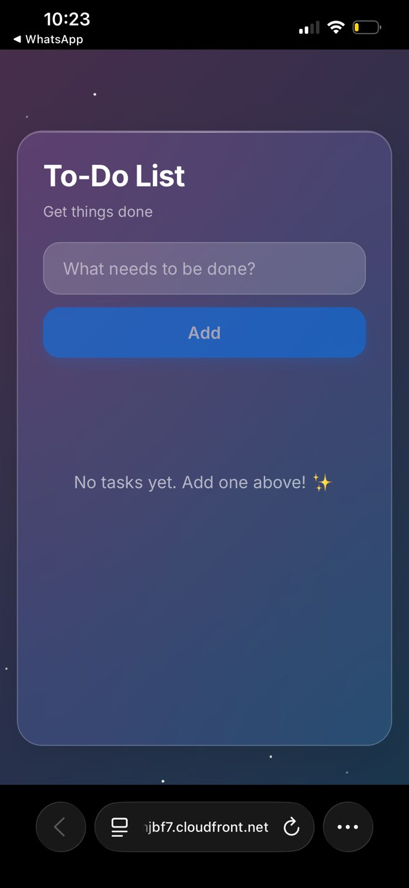

# 🚀 AWS Scalable To-Do List App


A modern, full-stack serverless To-Do List application built with React and deployed on AWS infrastructure. Features a beautiful **glassmorphism UI design** with **iOS-style interactions** and animations.

**🌐 [Live Demo](https://d2tjhu6fumjbf7.cloudfront.net)** | **📚 [Full Documentation](./APP_DESCRIPTION.md)** | **🚀 [Deployment Guide](./DEPLOYMENT_GUIDE.md)**

---

## 🎯 Quick Start

### **Local Development (2 minutes)**

```bash
# 1. Clone repository
git clone https://github.com/Kutlwano-Take/aws-scalable-todo-app.git
cd aws-scalable-todo-app

# 2. Start mock backend
cd backend && npm install && npm start
# Backend runs on http://localhost:3000

# 3. Start frontend (new terminal)
cd app
cp .env.example .env  # Copy example, edit with your API URL
npm install && npm run dev
# Frontend runs on http://localhost:5173
```

### **Production Deployment**

```bash
# 1. Deploy infrastructure
cd infra
terraform init && terraform apply

# 2. Build and deploy frontend
cd ../app
npm run build
aws s3 sync dist/ s3://{your-bucket}/ --delete
aws cloudfront create-invalidation --distribution-id {your-id} --paths "/*"
```

**📖 See [DEPLOYMENT_GUIDE.md](./DEPLOYMENT_GUIDE.md) for detailed instructions.**

---

## 📸 Screenshots

### **Mobile View**


*Glassmorphism design on mobile device showing the beautiful frosted glass UI with gradient background*

### **Features Showcase**
- ✅ **Glassmorphism Design** - Frosted glass cards with backdrop blur
- ✅ **iOS-Style UI** - Native iOS interactions and animations
- ✅ **Responsive Layout** - Perfect on all screen sizes
- ✅ **Task Management** - Create, toggle, and delete tasks with ease

**Additional Screenshots:**
- Desktop view (to be added)
- Task persistence demonstration (to be added)
- Swipe-to-delete gesture (to be added)

---

## ✨ Features

### **Core Functionality**
- ✅ **Full CRUD** - Create, Read, Update, Delete tasks
- ✅ **Task Filtering** - All, Active, Completed views
- ✅ **Persistent Storage** - DynamoDB integration
- ✅ **Optimistic UI** - Instant feedback with error rollback

### **UI/UX**
- 🎨 **Glassmorphism Design** - Frosted glass cards with backdrop blur
- 📱 **iOS-Style** - Native iOS interactions and animations
- 👆 **Swipe to Delete** - Mobile gesture support
- ✨ **Smooth Animations** - Staggered entries, checkmark bounces
- 🌈 **Animated Background** - Gradient with star sparkles

---

## 🏗️ Architecture

**Serverless Stack:**
- **Frontend:** React 18 + TypeScript + Vite → S3 + CloudFront
- **Backend:** AWS Lambda (Node.js 20.x) + API Gateway
- **Database:** DynamoDB (PAY_PER_REQUEST)
- **Infrastructure:** Terraform (IaC)

**📊 [See full architecture details](./APP_DESCRIPTION.md#architecture-overview)**

---

## 💰 Cost Estimate

**Estimated Monthly Cost: AWS Free Tier eligible

| Service | Free Tier | Estimated Cost |
|---------|-----------|----------------|
| **S3** | 5GB storage, 20K GET requests | $0 (within free tier) |
| **CloudFront** | 50GB data transfer, 2M requests | $0 (within free tier) |
| **Lambda** | 1M requests, 400K GB-seconds | $0 (within free tier) |
| **API Gateway** | 1M requests/month | $0 (within free tier) |
| **DynamoDB** | 25GB storage, 200M read/write units | $0 (on-demand, minimal usage) |
| **CloudWatch** | 10 custom metrics, 5GB logs | $0 (within free tier) |

**Beyond Free Tier:** R0/month for typical usage (1000+ users/day)

---

## 📡 API Endpoints

| Method | Endpoint | Description |
|--------|----------|-------------|
| `GET` | `/todos` | Fetch all tasks |
| `POST` | `/todos` | Create new task |
| `PUT` | `/todos/{id}/toggle` | Toggle completion |
| `DELETE` | `/todos/{id}` | Delete task |

**Base URL:** Configure via `VITE_API_URL` environment variable (see `.env.example`)

---

## 🔒 Security

- ✅ HTTPS enforced (CloudFront)
- ✅ S3 access restricted (Origin Access Control)
- ✅ IAM least privilege
- ✅ Environment variables (no hardcoded secrets)
- ✅ CORS properly configured

---

## 📊 Monitoring

**CloudWatch Integration:**
- ✅ Lambda error logs
- ✅ API Gateway request logs
- ✅ CloudWatch alarms (Lambda errors > 5)
- ✅ Budget alerts configured

**See [DEPLOYMENT_GUIDE.md](./DEPLOYMENT_GUIDE.md#monitoring) for monitoring setup.**

---

## 🛠️ Tech Stack

**Frontend:**
- React 18.3.1 + TypeScript 5.6.3
- Vite 5.4.8 (build tool)
- Custom CSS (glassmorphism, no frameworks)

**Backend:**
- AWS Lambda (Node.js 20.x)
- API Gateway (REST API)
- DynamoDB (NoSQL)

**Infrastructure:**
- Terraform (IaC)
- S3 + CloudFront (hosting)
- IAM (security)

---

## 📚 Documentation

- **[APP_DESCRIPTION.md](./APP_DESCRIPTION.md)** - Complete app overview
- **[DEPLOYMENT_GUIDE.md](./DEPLOYMENT_GUIDE.md)** - Deployment instructions
- **[PROJECT_STATUS.md](./PROJECT_STATUS.md)** - Current status
- **[CHANGELOG.md](./CHANGELOG.md)** - Version history
- **[TESTING_CHECKLIST.md](./TESTING_CHECKLIST.md)** - Testing procedures

---

## 🚧 Future Enhancements

- [ ] User authentication (AWS Cognito)
- [ ] User-specific task lists
- [ ] Task categories/tags
- [ ] Due dates and reminders
- [ ] PWA features (offline support)

---

## 📝 License

Educational project - AWS Scalable Web App Infrastructure (Month 3)

**Version:** 2.0 | **Status:** ✅ Production Ready | **Last Updated:** January 13, 2026
